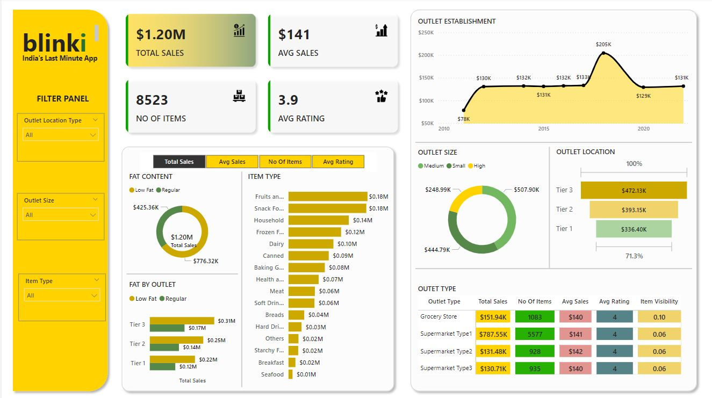

# Blinkit-Sales-Insights

#### Introduction

***This is a comprehensive Sales dashboard designed to provide insights into the performance of Blinkit's Sales. It offers a visual representation of key metrics and trends, enabling stakeholders to make data-driven decisions.***

#### Overall Performance

**Total Sales:** The company has generated a total of ***$1.20 million in sales***, which is a significant achievement. 
**Average Sales:** The average sales per outlet are ***$141***, indicating a relatively strong performance across the network. 
**Outlet Establishment:** The number of outlets has steadily increased over time, suggesting a growth strategy focused on expansion. 
     
#### Product Performance

**Item Type:** The ***"Frozen Food"*** category appears to be the top-selling item type, followed by ***"Grocery Store."*** This information can be used to optimize inventory and marketing efforts. 
**Item Rating:** The average item rating of ***3.9*** is generally positive, but there is room for improvement in certain product categories. 
**Item Volatility:** Analyzing item volatility can help identify products with fluctuating demand, allowing for better inventory management and pricing strategies. 

#### Outlet Performance

**Outlet Location Type:** The ***"Outlet"*** location type seems to be the most successful in terms of total sales and average rating. 
**Outlet Size:** Medium-sized outlets appear to be performing well, indicating that they may be the optimal size for the business model. 
**Outlet Tier:** Tier 3 outlets are generating the highest total sales, but their average rating is slightly lower than that of Tier 1 and Tier 2 outlets. 

## Key Areas for Improvement

**Item Rating:** While the overall item rating is positive, there are opportunities to improve ratings for specific product categories. 
**Outlet Tier Performance:** Tier 1 and Tier 2 outlets could benefit from strategies to increase their total sales. 
**Customer Segmentation:** Developing a more refined customer segmentation strategy can help tailor marketing efforts and product offerings to specific customer needs. 

#### Additional Insights

**Outlet Establishment Trend:** Analyzing the trend in outlet establishment can help identify areas with high growth potential. 
**Customer Satisfaction:** Gathering feedback from customers can provide valuable insights into their satisfaction levels and identify areas for improvement. 
**Competitive Analysis:** Comparing the performance of Blinkit's outlets to competitors can help identify opportunities for differentiation and improvement. 
By leveraging these insights, Blinkit can make informed decisions to optimize its operations, improve customer satisfaction, and drive sustainable growth.

